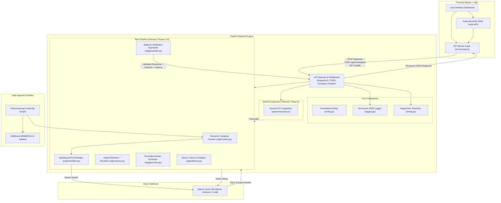

# System Architecture Specification

## Voice-Enabled Multilingual RAG System (HH Goa 2026 Task 2)

This document provides a comprehensive technical breakdown of the Voice-Enabled RAG System architecture. The system is designed to ingest voice input (in Indic languages via Sarvam AI STT) or text input, retrieve relevant context from indexed multilingual datasets (AI4Bharat MSMARCO-XI) using Qdrant vector database, generate grounded answers via an LLM, enforce strict guardrails, and provide high-resolution latency telemetry.

---

## 1. High-Level System Architecture Diagram

---

## 2. Implemented vs. Planned Capabilities Matrix

| Subsystem / Feature | Phase 1 Status | Target Phase | Implementation Details |
|---|---|---|---|
| **Monorepo Foundation** | ✅ **IMPLEMENTED** | Phase 1 | Clean monorepo structure with FastAPI backend & React frontend |
| **Centralized Config** | ✅ **IMPLEMENTED** | Phase 1 | Pydantic `BaseSettings` loading `.env` variables |
| **High-Precision Timing** | ✅ **IMPLEMENTED** | Phase 1 | `StageTimer` with nanosecond precision for multi-stage tracking |
| **Request ID Tracking** | ✅ **IMPLEMENTED** | Phase 1 | `REQ-YYYYMMDD-HHMMSS-<uuid>` injected into request context |
| **Global Error System** | ✅ **IMPLEMENTED** | Phase 1 | Custom exception hierarchy mapping to clean JSON error payloads |
| **Vector DB Abstraction** | ✅ **IMPLEMENTED** | Phase 1 | Qdrant client connection & health check manager |
| **Health API Endpoint** | ✅ **IMPLEMENTED** | Phase 1 | `GET /health` returning status and Qdrant connectivity |
| **Query Endpoints** | ⚠️ **PLACEHOLDER** | Phase 1 / 4 | `POST /api/query` and `POST /api/voice/query` return structured 501 |
| **React Frontend Skeleton** | ✅ **IMPLEMENTED** | Phase 1 | React + Vite UI displaying live backend status ping |
| **Dataset Ingestion & Prep** | ✅ **IMPLEMENTED** | Phase 2 | `AI4Bharat/MSMARCO-XI` streaming downloader & JSONL preprocessor |
| **Adaptive Chunking** | ✅ **IMPLEMENTED** | Phase 3 | Sentence boundary-aware semantic chunker with TF-IDF cosine similarity |
| **Multilingual Embedding** | ✅ **IMPLEMENTED** | Phase 4 | `intfloat/multilingual-e5-small` dense vector generation |
| **Qdrant Vector Indexing** | ✅ **IMPLEMENTED** | Phase 4 | Idempotent vector indexing in Qdrant with complete metadata payload |
| **RAG Answer Generation** | ✅ **IMPLEMENTED** | Phase 5 | Grounded response generator with prompt injection shielding & citations |
| **API Query Endpoint** | ✅ **IMPLEMENTED** | Phase 5 | `POST /api/query` returning answer, sources, and latency breakdown |
| **Sarvam STT Integration** | ✅ **IMPLEMENTED** | Phase 6 | Audio processing, Indic STT transcript extraction & `POST /api/voice/query` |
| **Guardrails & Safety** | ✅ **IMPLEMENTED** | Phase 6 | Prompt injection shielding, retrieval confidence & output grounding checks |
| **Benchmarking & Telemetry**| ✅ **IMPLEMENTED** | Phase 7 | Latency percentiles (P50/70/100), IR metrics (Recall@5, MRR), chunking benchmark |

---

## 3. Data Flow Overview

1. **Voice Query Flow:**
   - User speaks into React Frontend Audio Recorder.
   - Frontend posts audio payload to `/api/voice/query`.
   - FastAPI middleware assigns Request ID and initializes `StageTimer`.
   - `SarvamSTT` converts audio to text transcript (`stt_ms`).
   - `MultilingualEmbedder` creates dense vector (`embedding_ms`).
   - `QdrantRetriever` queries vector DB for top-K matching passages (`retrieval_ms`).
   - `RAGGenerator` synthesizes answer strictly using retrieved context (`generation_ms`).
   - `Guardrails` validates groundedness and sanitizes output (`guardrails_ms`).
   - Response returned to client with complete `LatencyMetrics` breakdown.

2. **Text Query Flow:**
   - Direct text query through `/api/query` bypassing STT phase (`stt_ms = 0`).
